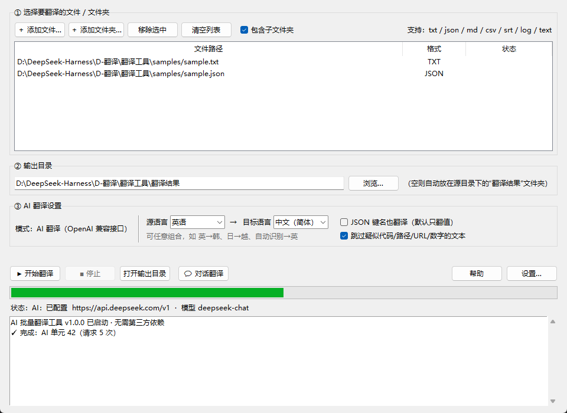
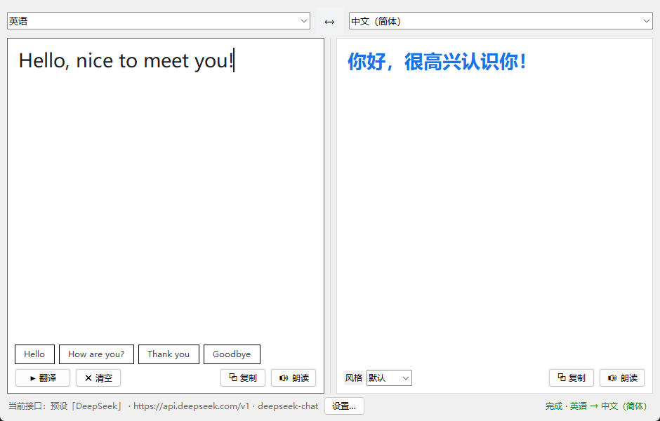

# AI 批量翻译工具 · AI Batch Translator

一个 **Windows 桌面翻译工具**：既能**批量翻译整个文件夹里的 txt / json / md / csv / srt 等文件**，
也有一个**左右双面板的对话翻译窗口**随手翻译句子。支持多语言任意互译、多组 API 预设一键切换，
**纯 Python 标准库实现，零第三方依赖**。

**简体中文** | [English](README.en.md)

[](https://www.python.org/)
[](LICENSE)
[](#运行环境)
[](#运行环境)
[](https://github.com/HeSheng114514/AI-Batch-Translator)

---

## 界面预览

| 批量翻译（主界面） | 对话翻译（双面板） |
| :---: | :---: |
|  |  |

## 功能特性

- **批量翻译**：一次选中多个文件或整个文件夹（可递归子目录），输出到独立目录，**绝不覆盖原文件**。
- **实时进度条**：按 AI 请求批次推进，翻译大文件也能看到进度；日志显示每个文件的请求次数与耗时。
- **多语言任意互译**：主界面「源语言 → 目标语言」两个下拉框自由组合，例如 **英→韩、日→越、中→日**；
  另有「自动识别」，按文字体系（假名/谚文/西里尔…）自动判断语种。
- **多组接口预设**：设置里保存多组 `Base URL + API Key + 模型`，下拉即可**一键切换**（DeepSeek / OpenAI / 通义 / 智谱 / Kimi…）。
- **对话翻译面板**：左右双面板、大字号输入与译文、示例短语、语气风格（默认 / 非正式 / 正式）、一键复制与语音朗读。
- **格式智能处理**：
  - `json`：保留结构与键名，只翻字符串值；自动跳过 URL、路径、数字、版本号、UUID、代码标识符；
  - `srt`：保留序号与时间轴，只翻字幕文本；
  - `csv`：保留表头与行列结构，自动识别 `,` `;` `\t` 分隔符；
  - `txt / md / log / text`：按行翻译，空行与段落结构保留。
- **零依赖**：只用 Python 标准库（tkinter + urllib），不需要 `pip install`。
- **编码友好**：输入自动识别 UTF-8 / UTF-16 / GBK；输出编码可选 UTF-8 / UTF-8(含 BOM) / GBK（Excel 打开 CSV 不乱码）。

## 运行环境

- Windows 10 / 11
- Python 3.8 或更高（[官网下载](https://www.python.org/downloads/)，安装时勾选 *Add Python to PATH*；官方安装包自带 tkinter）
- 需要网络与一个 AI 接口的 API Key（支持任何 OpenAI 兼容接口）

## 快速开始

1. 下载或克隆本仓库：
   ```bash
   git clone https://github.com/HeSheng114514/AI-Batch-Translator.git
   ```
2. 双击 **`start.bat`**（中文用户也可双击 `启动翻译工具.bat`），或命令行运行：
   ```bash
   python main.py
   ```
3. 点右下角 **【设置…】** → 在「接口预设」里点 **＋ 新建预设…**，填入 Base URL / API Key / 模型，点 **测试连接** 验证。
4. **批量翻译**：添加文件或文件夹 → 选输出目录 → 选「源语言 → 目标语言」→ 点 **▶ 开始翻译**。
5. **对话翻译**：点底部 **💬 对话翻译** → 左边写内容 → 点 **▶ 翻译**（或 `Ctrl+Enter`）。

## AI 接口配置

在【设置】的「接口预设」中可保存多组账号，下拉选择即切换：

| 服务 | Base URL | 模型示例 |
| --- | --- | --- |
| DeepSeek | `https://api.deepseek.com/v1` | `deepseek-chat` |
| OpenAI | `https://api.openai.com/v1` | `gpt-4o-mini` |
| 通义千问（兼容模式） | `https://dashscope.aliyuncs.com/compatible-mode/v1` | `qwen-plus` |
| 智谱 GLM | `https://open.bigmodel.cn/api/paas/v4` | `glm-4-flash` |
| Moonshot Kimi | `https://api.moonshot.cn/v1` | `moonshot-v1-8k` |

> 🔐 **API Key 保存在程序目录的 `config.json`（明文，仅本机使用）**，该文件已在 `.gitignore` 中，请勿提交或分享。

## 翻译语言

源语言（含「自动识别」）与目标语言各 18 种：英 / 中 / 日 / 韩 / 法 / 德 / 俄 / 西 / 意 / 葡 / 泰 / 越 / 阿拉伯 / 印地 / 希腊 / 荷兰 / 波兰 / 土耳其。

- 已经是目标语言的内容不会被重复翻译（例如 英→韩 时韩文原样保留）；
- 拉丁字母语言（英/法/德…）文字体系相同、无法靠字形区分，选哪种就按哪种语义翻译即可。

## 格式支持

| 格式 | 处理方式 |
| --- | --- |
| `.txt` `.md` `.log` `.text` | 按行翻译，空行与段落保留 |
| `.json` | 保留结构与键名（可选「键名也翻译」），只翻字符串值，自动跳过代码类文本 |
| `.srt` | 保留序号与时间轴，只翻字幕文本 |
| `.csv` | 保留表头与行列结构，自动识别分隔符 |

- 相同文本自动去重，只调一次 AI，节省额度；同一批文件共享缓存；
- 调用自动分批、失败自动重试，个别段落标记异常会退回逐段翻译，保证结果完整。

## 项目结构

```
AI-Batch-Translator/
├─ main.py                    入口
├─ app.py                     主界面（批量翻译 + 进度条 + 多预设设置）
├─ chat_window.py             对话翻译面板（双面板 + 朗读/复制/风格）
├─ engine.py                  翻译引擎（txt/json/csv/srt 管线 + 分批进度）
├─ ai_client.py               OpenAI 兼容 AI 客户端（urllib，无依赖）
├─ langs.py                   多语言支持：文字识别 / 语言下拉 / 方向
├─ config.py                  配置读写（config.json）与项目标识
├─ start.bat                  双击启动（ASCII 文件名）
├─ 启动翻译工具.bat             中文启动入口（调用 start.bat）
├─ samples/                   示例文件（sample.txt / sample.json）
├─ screenshots/               README 截图
├─ .github/ISSUE_TEMPLATE/    Issue 模板
├─ .gitignore / .gitattributes
├─ requirements.txt           说明：无需第三方依赖
├─ CHANGELOG.md               更新日志
└─ LICENSE                    GPL-3.0
```

## 常见问题

1. **点“开始翻译”提示未配置**：先在【设置】里新建/选择预设，填好 Base URL、API Key、模型三项。
2. **测试连接报错**：`401/403` Key 无效或额度不足；`404` Base URL 写错（通常以 `/v1` 结尾）；`429` 请求过频或余额不足。
3. **想中途停止**：点「■ 停止」，当前批次结束后停止。
4. **中文也被翻译了？** 检查「源语言 / 目标语言」是否选反，或改用「自动识别」。
5. **朗读停不下来？** 再点一次「🔊 朗读」即可停止；关闭窗口或退出程序也会立即停止。
6. **中文乱码**：用 Excel 打开 CSV 请把输出编码设为「UTF-8（含 BOM）」。

## 参与贡献

欢迎提 [Issue](https://github.com/HeSheng114514/AI-Batch-Translator/issues) 反馈问题或建议，
提交 PR 前请确保 `python -m py_compile *.py` 通过。如果这个工具帮到了你，欢迎点个 ⭐ Star。

## 许可证

[GNU General Public License v3.0](LICENSE) © 2025 HeSheng114514
